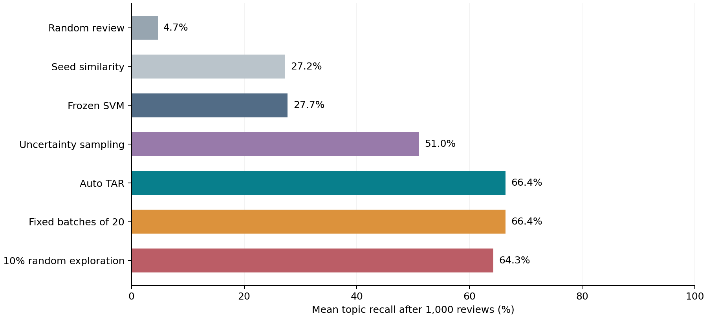

# IST Review Lab

**Can learning from each review decision help us find useful material sooner?**

A small, auditable reproduction of a continuous active learning paper, with a separate prototype for prioritizing eDiscovery matter signals in a BDR's research queue.

**Measured:** 23,149 public RCV1 documents, five topics, three seeds, seven methods, 105 runs. Auto TAR achieved **66.4% mean topic recall after 1,000 reviews**, versus **4.7% for random review** and **27.7% for a frozen model**. The original paper's full numerical results are **not replicated**; this is a scoped method reproduction with explicit deviations.



## Start here

- Read `RESULTS.md` for measured outcomes and failed improvements.
- Open `Walkthrough.ipynb` for the guided, executable introduction.
- Read `docs/IMPLEMENTATION_TASKS.md` to learn the project in eight tasks.
- Use `docs/PAPER_COMPARISON.md` to see the preserved and changed parts.
- Use `docs/IST_PLAYBOOK.md` to try the separate matter-signal queue.

## Run locally

Python 3.12 is the recorded environment. No GPU, Node.js, paid API or API key is required. Installing Python or packages may require your organization's usual IT process; Google Colab can run the notebook in a browser if permitted.

```bash
python -m venv .venv
```

Activate the environment with `.venv\Scripts\activate` on Windows or `source .venv/bin/activate` on macOS/Linux, then:

```bash
python -m pip install -r requirements.txt
python -m unittest discover -s tests -v
python -m src.bdr_queue --input data/example_signals.csv --output results/example_queue.csv --as-of 2026-09-07
```

The example uses fictional signals. Replace them with your own approved, sourced records and judgments to use the tool meaningfully. Keep labels blank for unread items and mark confirmed useful/non-useful examples 1/0. Update labels in the original CSV and rerun to retrain.

## Reproduce the benchmark

Run commands from the project root. The first benchmark command downloads about 3.9 MB of public token/label data and verifies its SHA-256. Saved results are included so you can inspect them without downloading data.

```bash
python -m src.experiment --jobs 2
python -m src.verify_results
python -m src.replay
python -m src.summarize
```

The original run took about 6.7 minutes with two CPU workers in the recorded environment. Your time may differ. For consistent CPU measurements, use one BLAS thread per worker; on macOS/Linux prefix with `OPENBLAS_NUM_THREADS=1 OMP_NUM_THREADS=1`. Rerunning experiments overwrites the local `results/runs.csv` and matching audit files, so make a copy before starting new variants. `results/environment.json` contains package versions and the configuration hash.

## Browser-only route with Google Colab

1. Open [Google Colab](https://colab.research.google.com/) and upload `Walkthrough.ipynb` from the extracted ZIP.
2. Upload `IST_Review_Lab.zip` through Colab's Files pane. The first notebook cell extracts it if needed.
3. If dependencies are missing, run the installation command described in the notebook, then run its cells in order.
4. Replace the example CSV with your own sourced signals when you are ready. Keep confidential material within your organization's approved environment.

The notebook's walkthrough cells were executed in the local Python environment; the Colab browser flow itself was not exercised here.

## Portfolio structure

| File or folder | Purpose |
|---|---|
| `experiment_plan.json` | Hypotheses, topics, seeds, budgets and metrics fixed before runs |
| `src/learner.py` | Label-blind ranking and active-learning policies |
| `src/data.py` | Source verification and sparse text representation |
| `src/experiment.py` | Reviewer simulation with saved audit trails |
| `src/verify_results.py`, `src/replay.py` | Independent arithmetic and deterministic replay |
| `src/bdr_queue.py` | Practical CSV ranking from your own judgments |
| `tests/` | Six behavioral and integrity checks |
| `results/` | All measurements, per-topic tables, figures and review orders |
| `docs/` | Implementation plan, paper comparison, limitations and IST pilot guide |
| `data/` | Synthetic examples, blank template and source checksum |

## How to present the work honestly

This is an AI-assisted research and implementation foundation. A strong portfolio story explains the problem, why the baselines matter, what was tested, what failed and what remains unvalidated. After you understand the code and run your own extension, describe your contribution precisely. Do not claim to have independently authored code you did not write or validated revenue effects you did not measure.

The BDR queue uses a separate class-balanced SVM with confirmed positive and negative examples. It is not the benchmark model, does not discover leads by itself, and has no measured IST sales results. Its ranking scores are not probabilities. The experiment is educational and has no claim of IST affiliation or endorsement.

## Research sources

- Cormack and Grossman (2015), [Autonomy and Reliability of Continuous Active Learning for Technology-Assisted Review](https://arxiv.org/abs/1504.06868).
- Lewis et al. (2004), [RCV1: A New Benchmark Collection for Text Categorization Research](https://jmlr.org/papers/v5/lewis04a.html).
- [LIBSVM public dataset page](https://www.csie.ntu.edu.tw/~cjlin/libsvmtools/datasets/multilabel.html).

Raw benchmark downloads are excluded from this package. Their source terms remain applicable; this project does not grant rights to Reuters content. See `docs/DATA_AND_MODEL_CARD.md` for data and evaluation limitations.
